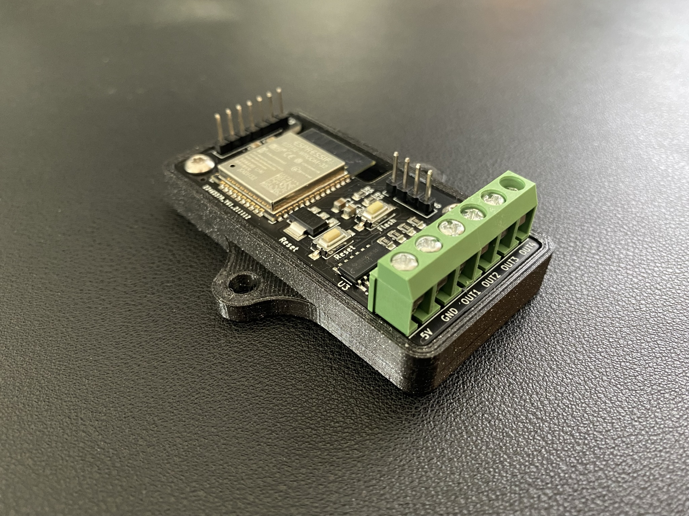
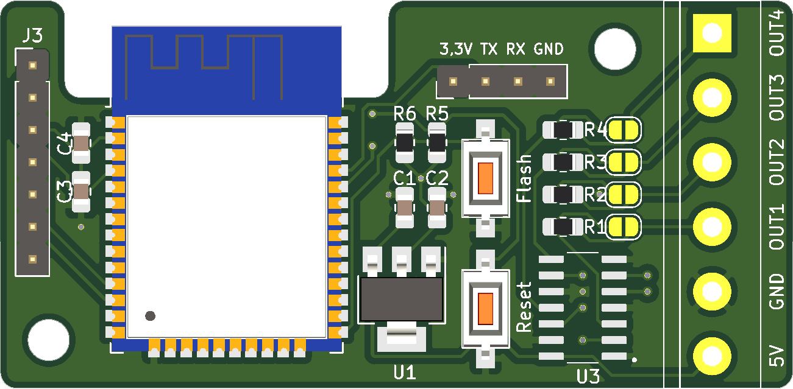
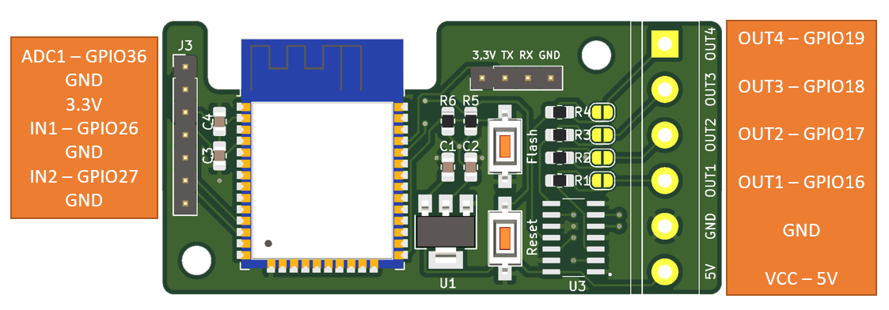

Shield: [![CC BY-NC-SA 4.0][cc-by-nc-sa-shield]][cc-by-nc-sa]

This work is licensed under a
[Creative Commons Attribution-NonCommercial-ShareAlike 4.0 International License][cc-by-nc-sa].

[![CC BY-NC-SA 4.0][cc-by-nc-sa-image]][cc-by-nc-sa]

[cc-by-nc-sa]: http://creativecommons.org/licenses/by-nc-sa/4.0/
[cc-by-nc-sa-image]: https://licensebuttons.net/l/by-nc-sa/4.0/88x31.png
[cc-by-nc-sa-shield]: https://img.shields.io/badge/License-CC%20BY--NC--SA%204.0-lightgrey.svg

## Donations / Spenden
If somebody wants to support me for upcoming projects :)  
- PayPal:  
- Amazon Giftcard: https://www.amazon.de/Amazon-Gutschein-per-E-Mail-Amazon/dp/B0054PDOV8 - stefan.riese@me.com

# WLED ESP32 Controller
This board is designed to connect addressable LEDs/Neopixel strips and handle them with the WLED firmware. Other firmware can be used as well.

## Features
- 5V/GND connector for input voltage
- 4 output lines for LED data or relais
- level shifter for all 4 outputs (3.3V -> 5V )
- resistor for data lines
- support for LED strips with clock signal
- connector for microphone sensor or button input (ADC1, GND, 3.3V, IN1, GND, IN2, GND)
- connector to flash firmware with CP2104 (3.3V, TX, RX, GND)

## BOM
- 1 x WLED ESP32 Controller presoldered from https://jlcpcb.com/

|Comment|Designator|Footprint|LCSC
|---|---|---|---
10µ|C1,C3|Capacitor_SMD:C_0805_2012Metric_Pad1.18x1.45mm_HandSolder|C15850
47µ|C2|Capacitor_SMD:C_0805_2012Metric_Pad1.18x1.45mm_HandSolder|C16780
100n|C4,C5|Capacitor_SMD:C_0805_2012Metric_Pad1.18x1.45mm_HandSolder|C49678
MountingHole|H1,H2|MountingHole:MountingHole_3.2mm_M3_DIN965|
Conn_01x06_Female|J1|TerminalBlock:TerminalBlock_bornier-6_P5.08mm|
Conn_01x04_Female|J2|Connector_PinHeader_2.54mm:PinHeader_1x04_P2.54mm_Vertical|
Conn_01x07_Female|J3|Connector_PinHeader_2.54mm:PinHeader_1x07_P2.54mm_Vertical|
Jumper_NO_Small|JP1,JP2,JP3,JP4|Jumper:SolderJumper-2_P1.3mm_Open_RoundedPad1.0x1.5mm|
330|R1,R2,R3,R4|Resistor_SMD:R_0805_2012Metric_Pad1.20x1.40mm_HandSolder|C17630
10K|R5,R6|Resistor_SMD:R_0805_2012Metric_Pad1.20x1.40mm_HandSolder|C17414
Reset|SW1|Button_Switch_SMD:SW_SPST_CK_RS282G05A3|C354943
Flash|SW2|Button_Switch_SMD:SW_SPST_CK_RS282G05A3|C354943
AMS1117-3.3|U1|Package_TO_SOT_SMD:SOT-223-3_TabPin2|C6186
ESP32-WROOM-32|U2|RF_Module:ESP32-WROOM-32|C82899
SN74AHCT125D|U3|WLED_ESP32:SOIC127P600X175-14N|C155176
	
	
- 3 x 2-pin screw terminal (https://www.amazon.de/gp/product/B08JB6SSCJ)
- 1 x 4-pin header male
- 1 x 7-pin header male

## Wiring diagram
- https://github.com/Hasenpups/WLED_ESP32_Controller/blob/main/WLED_ESP32_Controller.pdf

## Software
- WLED: https://github.com/Aircoookie/WLED/releases
- Sound Reactive WLED: https://github.com/atuline/WLED/releases

## How to flash software
- Connect USB-UART bridge to 3.3V, TX, RX and GND
    - https://de.aliexpress.com/item/1005002689033373.html
    - https://www.makershop.de/module/kommunikation-module/micro-usb-uart-ttl/
- Press and hold "Flash" button
- Press "Reset" button and release
- Release "Flash" button
- Open https://install.wled.me/
- Click "Install"
- Select COM port of USB-UART bridge
- Wait until finished

## WLED configuration
- OUT1 - IO16
- OUT2 - IO17
- OUT3 - IO18
- OUT4 - IO19
- Microphone input - IO36
- Button input 1 - IO26
- Button input 2 - IO27

## Case
- https://www.prusaprinters.org/prints/124223-wled-controller-base-housing
- https://www.printables.com/model/163438-housing-for-esp32-wled-controller
